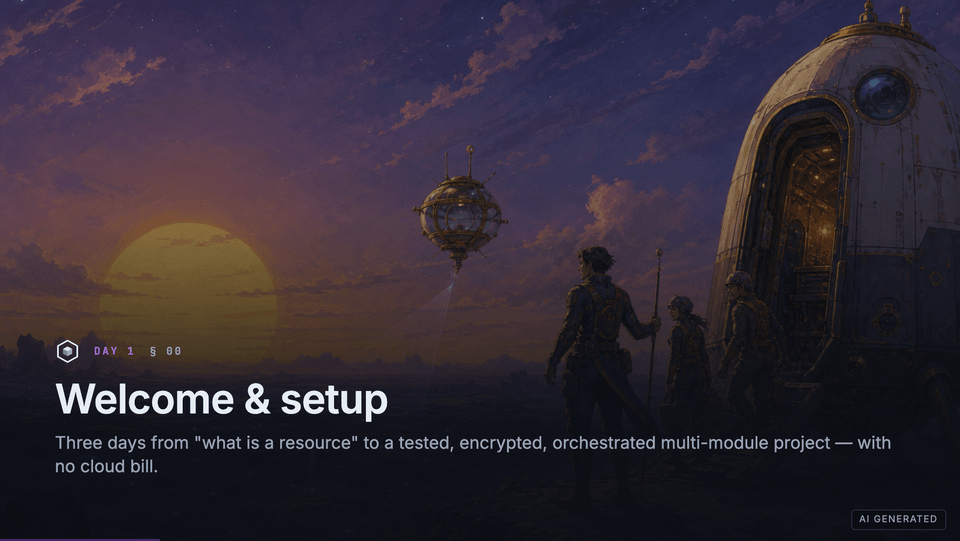

# OpenTofu Practitioner Workshop

[](https://github.com/PlatformRelay/OpenTofu-Workshop/actions/workflows/ci.yml)
[](https://github.com/PlatformRelay/OpenTofu-Workshop/actions/workflows/pages.yml)
[](https://platformrelay.github.io/OpenTofu-Workshop/)
[](https://github.com/PlatformRelay/OpenTofu-Workshop/releases)
[](https://github.com/PlatformRelay/OpenTofu-Workshop/blob/main/LICENSE)

An open-source, vendor-neutral, hands-on workshop for **Infrastructure as Code
with [OpenTofu](https://opentofu.org)**. The learning journey follows the way
infrastructure grows in practice:

1. **Author** — learn HCL, the plan/apply workflow, state, encryption,
   validation, modules, naming, and labelling.
2. **Test** — add static checks, policy and security scanners, `check` blocks,
   native `tofu test`, mocks, integration tests, and CI.
3. **Scale** — use Terramate stacks, generation, orchestration, and change
   detection across a monorepo.

Roughly **50% is hands-on**.

**Preview it now:** docs and decks are live on GitHub Pages.

- **Documentation home:** <https://platformrelay.github.io/OpenTofu-Workshop/>
- **Live deck (full superset):** <https://platformrelay.github.io/OpenTofu-Workshop/deck/>
- **Live deck (canonical 3-day cut):** <https://platformrelay.github.io/OpenTofu-Workshop/deck/3day/>
- **Template gallery:** <https://platformrelay.github.io/OpenTofu-Workshop/deck/templates/>

Legacy `/3day/` and `/templates/` URLs redirect into `/deck/…`.



<sub>Real deck, no hand-taken screenshots: CI re-renders this tour from the slide sources
(`pnpm showcase:gif`).</sub>

> [!IMPORTANT]
> Labs use `mock_provider` or [LocalStack](https://localstack.cloud), an AWS
> emulator running on your machine. You need **no cloud account and incur no
> cloud bill**.

## Start here

For the standard learner route:

1. Open the [canonical three-day workshop](slides-3day.md). If a published deck
   is unavailable, serve it locally with `task dev:3day`.
2. Complete [Lab 00: setup and first resource](labs/day-1/00-setup.md), starting
   with `task setup` and then `task lab:up` when the lab asks for LocalStack.
3. If the emulator does not become healthy, use the
   [LocalStack setup and troubleshooting guide](setup/localstack.md).

> [!NOTE]
> All three days are authored: sections **S00–S26** and their labs, plus the
> capstone, are shipped (not stubs). Optional sections stay skippable via the
> cut-order / `hide:` toggles. The section library is a deliberate **superset**
> that runs longer than three days — read
> [Scope and timing](#scope-and-timing-known-issue) and apply the
> [Day 1 fit plan](#day-1-fit-plan) before facilitating.

### Prerequisites by workshop day

Run `task setup` before the workshop. It prints every detected version and
returns non-zero with install guidance and affected labs when something is
missing. It is safe to rerun and never installs without confirmation.

| Scope | Tools |
| --- | --- |
| Decks and Day 1 | OpenTofu ≥1.9, Node.js ≥20, pnpm, Task, Docker |
| Day 2 static analysis | TFLint |
| Day 2 security and policy | Trivy, Checkov, Conftest |
| Day 3 scale labs | Terramate |
| Optional Terratest (S18) | Docker (container lane) — or host Go ≥1.22 |

`gum`, `awslocal`, and the AWS CLI improve the local experience but are
optional. Go is **not** installed by default. Terratest is **container-first**
([ADR 0011](docs/decisions/0011-toolchain-lanes.md)):

```bash
task lab:terratest DIR=labs/fixtures/terratest-smoke   # pinned Go+tofu container vs LocalStack
# Host-Go alternative (optional):
BOOTSTRAP_WITH_GO=1 bash setup/bootstrap.sh            # or: bash setup/bootstrap.sh --with-go
task lab:up && task lab:terratest:host DIR=labs/fixtures/terratest-smoke
```

No Docker? The container lane fails fast and points at the host-Go commands
above.

## Choose your route

| I am a… | Start with | Then use |
| --- | --- | --- |
| Learner | [Docs home](https://platformrelay.github.io/OpenTofu-Workshop/) or [canonical three-day deck](https://platformrelay.github.io/OpenTofu-Workshop/deck/3day/) — offline: [slides-3day.md](slides-3day.md) / `task dev:3day` | [Lab 00](labs/day-1/00-setup.md) and the [labs index](https://platformrelay.github.io/OpenTofu-Workshop/labs/) |
| Facilitator | [Facilitator runbook](https://platformrelay.github.io/OpenTofu-Workshop/facilitator-runbook/) (clone: [docs/facilitator-runbook.md](docs/facilitator-runbook.md)) | [3-day deck](https://platformrelay.github.io/OpenTofu-Workshop/deck/3day/), the scope and timing warning below, and [Associate alignment](https://platformrelay.github.io/OpenTofu-Workshop/associate-alignment/) (design check, not exam prep) |
| Contributor | [Contributor guide](AGENT.md) | [Template gallery](slides-templates.md) / `task dev:templates` and the [decision index](docs/decisions/README.md) |

## Deck choices

The repository uses a **superset + boil-down** model: one section library,
several deliberately different cuts.

| Deck | Purpose | Local fallback |
| --- | --- | --- |
| [Three-day cut](slides-3day.md) | Canonical learner and facilitator route; pre-boiled for standard delivery | `task dev:3day` |
| [Full superset](slides.md) | Every section S00–S26; use it to compose a custom delivery, not as the default learner route | `task dev` |
| [Template gallery](slides-templates.md) | Contributor-facing design-system and slide-pattern reference; not a workshop cut | `task dev:templates` |

Sections live in `pages/SNN-topic/index.md` and decks compose them with `src:`
imports. Contributors can set `hide: true` on an import to omit a section from a
cut.

## Scope and timing (known issue)

> [!WARNING]
> This repository is a **content superset**: the section library (`S00`–`S26`)
> is deliberately **larger than fits in three days**. At a **390 min/day** budget
> (6.5 h, ~50/50 explain-then-run), the full superset runs well over three days,
> and even the canonical three-day cut **overflows on two of the three days** —
> see the published totals below. That is a deliberate design choice ("choice
> over fit"), not an oversight. For a standard delivery, start with the canonical
> three-day cut; when trimming further, cut **`optional` first, then
> `recommended`**, and keep `core`. Before facilitating Day 1, apply the
> [executable Day 1 fit plan](#day-1-fit-plan).

### Published day totals

Slides **and** labs for the canonical three-day cut, computed from
`canonicalDayTotals()` in `scripts/deck-manifest.mjs`. They are **unrehearsed
planning estimates** derived from section frontmatter, never rehearsal timings,
and the facilitator budget is 390 min/day:

- **Day 1 slides+labs: 790 min (planned)** — 540 slides + 250 labs, **+400 over** budget.
- **Day 2 slides+labs: 360 min (planned)** — 180 slides + 180 labs, 30 under budget.
- **Day 3 slides+labs: 400 min (planned)** — 200 slides + 200 labs, **+10 over** budget.

Two of the three days do not fit: plan the overflow rather than discovering it
mid-morning. The [fit plan](#day-1-fit-plan) below brings Day-1 **slide** time
down to 400 — a separate, slides-only deck-runtime figure that is itself 10
minutes over the budget. The 250 minutes of Day-1 lab time sit on top of it and
the fit plan does not touch them.

### Day 1 fit plan

This plan compresses **slide time only**. It starts at **705 minutes** of slide
time across all thirteen Day-1 sections (`dayOneSupersetSlidesTotal()`) and ends
at **400** (`dayOneFitTotal()`). Day-1 lab time — 250 minutes — is untouched, so
a fit-plan delivery still runs **650 minutes** of slides+labs against a 390
budget. Be precise about what the plan now buys. Since S01 grew to carry the
design-principles and alternatives beats, the compressed **deck alone** is 10
minutes over the whole-day budget, so the plan no longer makes even the deck fit
the day. What it does is remove 305 minutes of slide time and turn the remaining
overflow into a planned, published one instead of a mid-morning surprise.
Apply the rows in order. The first three remove optional/recommended material;
the remaining rows shorten core delivery while preserving each section's outcome.
The arithmetic is explicit: **705 → 670 → 615 → 540**, then
**540 → 525 → 500 → 485 → 470 → 455 → 440 → 425 → 410 → 400**.

| Order | Action | Minutes | Running total | Pedagogical cost |
| ---: | --- | ---: | ---: | --- |
| 1 | Skip S11 (optional); its `hide: true` toggle is already set | −35 | 670 | Defer the TACO vendor-selection landscape |
| 2 | Skip S10 (recommended) at its `DAY1-FIT` marker; keep `hide: false` | −55 | 615 | Defer the differentiator deep dive (incl. the import/adoption drill); S01's teaser and S05's encryption demo remain |
| 3 | Skip S09 (recommended) at its `DAY1-FIT` marker; keep `hide: false` | −75 | 540 | Defer the `count` vs `for_each` lesson, `dynamic` blocks, and `moved`/`removed` refactoring to follow-up study |
| 4 | Compress S00 from 40→25 at its marker | −15 | 525 | Move installation checks before class; retain orientation and first apply |
| 5 | Compress S01 from 55→30 at its marker | −25 | 500 | Make the detailed fork timeline pre-reading; retain why IaC, the design principles, the differentiators teaser, the alternatives, and governance |
| 6 | Compress S02 from 50→35 at its marker | −15 | 485 | Demo fewer block variants; retain syntax, references, and the break→fix |
| 7 | Compress S03 from 60→45 at its marker | −15 | 470 | Use one lifecycle run; retain plan reading and destroy |
| 8 | Compress S06 from 50→35 at its marker | −15 | 455 | Teach typed objects and validation; assign precedence variants as follow-up |
| 9 | Compress S15 from 50→35 at its marker | −15 | 440 | Teach one blocking condition plus `check`; assign the full assertion matrix |
| 10 | Compress S04 from 50→35 at its marker | −15 | 425 | Demonstrate state inspection live; assign backend migration as follow-up |
| 11 | Compress S05 from 60→45 at its marker | −15 | 410 | Demonstrate encryption; assign key rotation as follow-up |
| 12 | Compress S07 from 60→50 at its marker | −10 | **400** | Keep local module composition; demo registry/OCI lookup instead of running it |

`hide: true` remains reserved for optional sections, so S09/S10 and every core
section stay `hide: false`. Their comments in
[the three-day deck](slides-3day.md) are delivery markers, not tier changes.

The Day-1 resequencing (S06 and S15 moved ahead of S04 and S05) changed no
section's length, so it left the Day-1 planning total and every row above
untouched — only the order of rows 4–12 moved. The total moved later, and for a
different reason: S01 grew from 40 to 50 minutes when the design-principles and
alternatives beats were added, then to 55 when the OpenTofu-differentiators
teaser landed, and the Lab-04 drift step added 5 lab minutes on top, taking the
planning total to 790 and the fit-plan target to 400.

Skipping S09 and S10 carries a known, accepted cost: a learner on the canonical
cut **never sees `for_each` taught** — neither S09's `count` vs `for_each`
lesson and `moved`-based refactoring without replacement, nor S10's
provider-level `for_each` and `-exclude` — and, with S10, the hands-on
`import`/state-adoption drill of Lab 10 Part B. S01's differentiators teaser
*names* provider `for_each` and `-exclude` and points at S10 as follow-up, but
naming is not teaching: beyond it the keyword survives only incidentally, in a
`dynamic` block toggle inside the Day-3 capstone's provider boilerplate and in
an optional stretch prompt at the end of Lab 07; neither is taught or checked.
Restore S09 first if time returns.

## Common local commands

```bash
task setup          # detect/install the workshop toolchain and deck dependencies
task dev:3day       # serve the canonical workshop at localhost:3030
task lab:up         # start LocalStack for labs that require it
task lab:terratest  # optional: run Go tests in the pinned Terratest container
task verify         # run fmt, validation, tofu tests, and documentation contracts
task pages:build    # MkDocs + hash-routed decks → ./site (needs MkDocs)
task pages:preview  # serve ./site at http://localhost:4173
```

`task verify` / `scripts/verify.sh` need **Bash ≥4** (`shopt globstar`). macOS
`/bin/bash` is still 3.2 and fails if it wins on `PATH`; Homebrew bash 5 (or
CI's Ubuntu bash) is fine — put `/opt/homebrew/bin` or `/usr/local/bin` first.

No `task`? The underlying commands are plain `pnpm`, `tofu`, and Docker Compose;
see [Taskfile.yaml](Taskfile.yaml) for their exact definitions.

## Repository layout

```text
slides*.md            root decks (superset / 3-day / templates)
pages/SNN-topic/      one self-contained section per folder
labs/day-N/           standalone labs (LocalStack + mock)
modules/              naming/ + labels/ — the flagship tested modules
examples/             runnable roots wiring modules (LocalStack)
theme/                local Slidev theme (layouts, components, IacIcon)
components/           animated Vue teaching diagrams
public/icons/         OpenTofu marks + HCL block glyphs
mkdocs.yml            GitHub Pages docs site (Material)
docs/                 published MkDocs pages + ADRs under docs/decisions/
docs/facilitator-runbook.md  facilitator delivery guide
docs/associate-alignment.md  Associate coverage map (design check, not exam prep)
scripts/pages-build.sh       MkDocs + Slidev /deck/ Pages tree
setup/                bootstrap, lab runner, and environment guides
```

## Contributing

Read the [contributor guide](AGENT.md) for conventions, the lab authoring
contract, the Definition of Done, and guardrails. In short: OpenTofu-first
(`tofu`), vendor-neutral, Conventional Commits + gitmoji, and every lab task
carries a spoiler and a panic reset.

## Licence

**[0BSD](LICENSE)** — use, copy, modify, redistribute, and sell freely. No
attribution required. Copyright (C) 2026 Platform Relay.

“OpenTofu”, “Terraform”, and other marks belong to their respective owners; see
the [artwork attribution](public/icons/README.md).
